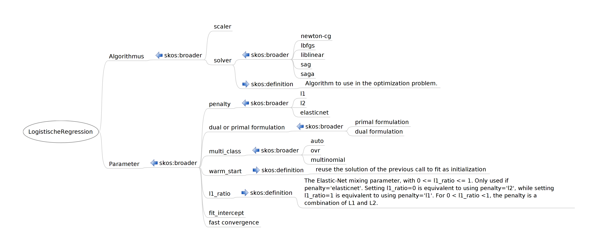

# Masterarbeit: scikit-learn Ontologie

Der User-Guide <https://scikit-learn.org/stable/user_guide.html> ist beeindruckend detailliert und umfassend.

In der Masterarbeit soll explorativ untersucht werden, wie die hunderte dort enthaltene Fachbegriffe sinnvoll in eine leichtgewichtige Ontologie überführt werden können. Insbesondere gilt es abzuschätzen, ob SKOS ausreichend ist, oder ob wir - Wer? Wozu? - eine ausdruckskräftigere Ontologiesprache benötigen.

## Vorüberlegungen zum Aufbau einer ML-Ontologie

Ein oft gewähltes, verführerisches Vorgehen zum Aufbau der Ontologie ist die Top-Down-Methode. Problem: sie eignet sich nicht, um realistisch die eigentlichen Herausforderungen zu erkennen. Denn ein erstes Dutzend von high-level Grundbegriffen einer Ontologie lassen sich vielleicht noch leicht als Baum anlegen; sobald man aber tiefer eintaucht, wimmelt es nur so von Poly-Hierarchien und komplexen Querbezügen. 

* Das wundert uns nicht: Eine Ontologie - jedenfalls eine fully-fledged OWL- oder auch rule based Ontologie -  lebt ja davon, dass Klassen durch z.T. komplexe logische Bezüge auf andere Klassen  definiert werden. 

* (Abgeschweift: Eine "gute" Ontologie zeichnet sich m.E.  auch dadurch aus, dass ihre Graph-Strukturen in der Tiefe verhältnismäßig regelmäßig und idealerweise sogar modular sind. Das untertsützt Nachvollziehbarkeit und Maintainability. Aber das ist eine andere Diskussion).

* Auch wenn wir aus verschiedenen Gründen zunächst kein OWL verwenden ist uns allen aber doch klar, dass wir mache dieser (in OWL eben komplex notierbaren)  Bezüge interessant finden, und wir diese eben auf andere Weise notieren und kommunizieren wollen.

Dehalb im Folgenden eine Kombination von Top-Down und Middle-Out.

**top-down**: Quelle sind eine Reihe von Cheat-Sheets, Tutorials, Inhaltsverzeichnisse, die man im Netz zum Thema Machine Learning duch Googeln findet. Auch wenn solche Dokumente ggf. nur die subjektive Meinung einzelner Autoren widerspiegeln, wertschätzen wir sie, weil sie aktuelles Praktikerwissen konsolidieren. Beispiele:

* <https://scikit-learn.org/stable/tutorial/machine_learning_map/index.html>
* <https://docs.microsoft.com/de-de/azure/machine-learning/media/algorithm-cheat-sheet/machine-learning-algorithm-cheat-sheet.svg>
* Übersicht über mehr Cheat-Sheets: <https://becominghuman.ai/cheat-sheets-for-ai-neural-networks-machine-learning-deep-learning-big-data-678c51b4b463>

**middle-out**: Wir nehmen uns eine spezielle praxisrelevante ML-Aufgabe vor - hier: Klassifikation mit logistischer Regression - und bauen aus einer einschlägigen Beschreibung der ML-Aufgabe einen speziellen Teil der Ontologie. Die Top-Level-Begriffe fallen dabei sozusagen automatisch mit ab. Vorgehen z.B.:

* Einen Text nehmen zu einer Bibliothek, hier z.B. `sklearn.linear_model.LogisticRegression`:
   * eine automatisch generierte [Doku](https://scikit-learn.org/stable/modules/generated/sklearn.linear_model.LogisticRegression.html) 
   * und einen manuell verfassten [User Guide](https://scikit-learn.org/stable/modules/linear_model.html#logistic-regression) 
* alle Fachbegriffe 'raussuchen, ggf. Wichtigkeit kennzeichnen
* clustern, ggf. mehrfach nach verschiedenen Kriterien
* Konzept-Hierarchien bauen, wo möglich und sinnvoll (das geht auch in SKOS oder RDFS)
* später dann Querbezüge einziehen:
   * SKOS erlaubt das lediglich schwach (aber ggf. ausreichend?),
   * OWL erlaubt das voll ausgebaut - aber brauchen wir das tatsächlich? Wollen wir das?

**Anknüpfen an andere Ontologien**

Idealerweise lassen sich die Ergebnisse unserer eigenen Konzeptualisierung an andere vergleichbare Projekte anknüpfen, wie z.B.:

ML-Schema: Exposing the Semantics of Machine Learning with Schemas and Ontologies

* <https://arxiv.org/abs/1807.05351>
* <http://www.semantic-web-journal.net/system/files/swj2134.pdf>
* <http://ml-schema.github.io/documentation/ML%20Schema.html#d4e601>

OntoDM-core ontology

* <http://www.ontodm.com/doku.php?id=start>

Allgemeine Suche nach Ontologien bietet z.B. <https://www.ebi.ac.uk/ols/search?q=machine+learning>


## identify interesting terms

Experiment: craft a semantic network based on a tech docu, here: <https://scikit-learn.org/stable/modules/generated/sklearn.linear_model.LogisticRegression.html>

    class sklearn.linear_model.LogisticRegression(
    penalty='l2', *, 
    dual=False, 
    tol=0.0001, 
    C=1.0, 
    fit_intercept=True, 
    intercept_scaling=1, 
    class_weight=None, 
    random_state=None, 
    solver='lbfgs', 
    max_iter=100, 
    multi_class='auto', 
    verbose=0, 
    warm_start=False, 
    n_jobs=None, 
    l1_ratio=None)
    
Hoffnung: Die Parameter und ihre möglichen Werte eignen sich als systematischer Hinweis auf "kognitive Konzepte" mit "zugehörigen" Werten ... tatsächlich glaube ich, dass sich aus der Analyse der Parameter und ihrer Werte ein Grundgerüst für unsere Ontologie bauen lassen könnte.


```{note}
**kognitive Konzepte**

Technische Implementierungsmöglichkeiten von "kognitiven Konzepten" und "zugehörigen" Werten:

* Klasse + Instanzen
* Property + Domain/Range
* in RDFS manuell definierte Sub-Properties von `skos:related` oder `skos:semanticRelation` (<https://www.w3.org/TR/skos-reference/#semantic-relations>)

Dazu sollten wir grundsätzlich klären: Wollen wir Domain/Range nutzen ...

* in der (für Laien unintuitiven) RDFS-Semantik für Inferencing (insbesondere <https://www.w3.org/TR/rdf11-mt/#rdfs-entailment> >  *rdfs3*) ?
* oder wünschen wir uns doch lieber eine (für Laien intuitivere) Semantik, wie sie in o.A. Doku vorfindlich ist - nämlich Range als eine Liste von *erlaubten* Werten, Range also in einer Constraint-Semantik?

Im ersten Fall bauen wir die Ontologie in einer Datenstruktur, die dem RDF(S) oder OWL-Metamodell genügt.Der klassische (und nur für Experten) geeignete Editor ist Protege, empfehlenswert sind andere.

Im zweiten Fall bauen wir die Ontologie in einer Datenstruktur, die dem Frames-Metamodell genügt. Hier können wir z.B. das UML-Metamodell und entsprechende Technology-Stacks verwenden.
```


## Begriffe

Begriffe, die in o.A. Doku jedenfalls interessant sind (nicht vollständig):

LogistischeRegression | auto | dual formulation | dual or primal formulation | elasticnet | fast convergence | fit\_intercept | l1 | l1\_ratio | l2 | lbfgs | liblinear | multi_class | multinomial | newton-cg | ovr | penalty | primal formulation | sag | saga | scaler | solver | warm\_start | 

Im folgenden der Versuch, diese Begriffe zunächst einmal graphisch zu ordnen:



Man sieht leicht: Hier wird die Ontologie informell als SKOS-Baum aufgebaut. Bemerkungen:

* Unbefriedigend ist z.B. das `skos:broader` bei *penalty*. Hier könnte man auch an `rdfs:range` denken - wenn man sich tatsächlich die ganzen RDFS-typischen entailment-Probleme einhandeln will ... ggf. anders machen: ein `skos:related`?

* Aber wir wissen ja: `skos:broader` ist *keine* transitive Relation. Deswegen ist das  `skos:broader` bei *penalty* auch unprobematisch.

* Die Def bei *l1-ratio* habe ich 'reingenommen um zu zeigen, welche Zusammenhänge man modellieren könnte, wenn man echte Herausforderungen sucht. Ich meine, wir sollten das nicht wollen ;-)

%Die Mindmap ist in (einer alten Version 1.3.15 von) Freeplane erstellt, Download: <images/LogistischeRegression.mm>.


## Ontologie-Editor

Welches Tool verwenden wir für die graphische Modellierung der Ontologie? Vorschlag JB: Wir verwenden in der Masterarbeit UML:

* ist für Informatik-Studierende als Tool und konzeptuell am ehesten anschlussfähig
* lässt sich auch in RDFS übesetzen, siehe z.B. <https://www.researchgate.net/publication/281690028_Construction_of_RDFS_from_UML_class_diagrams>
* TBD: Auswahl eines geeigneten UML-Editors, der RDFS importieren und exportieren kann


